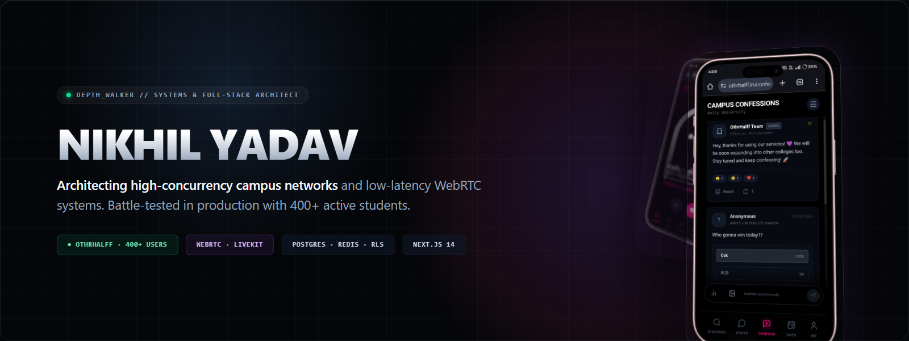
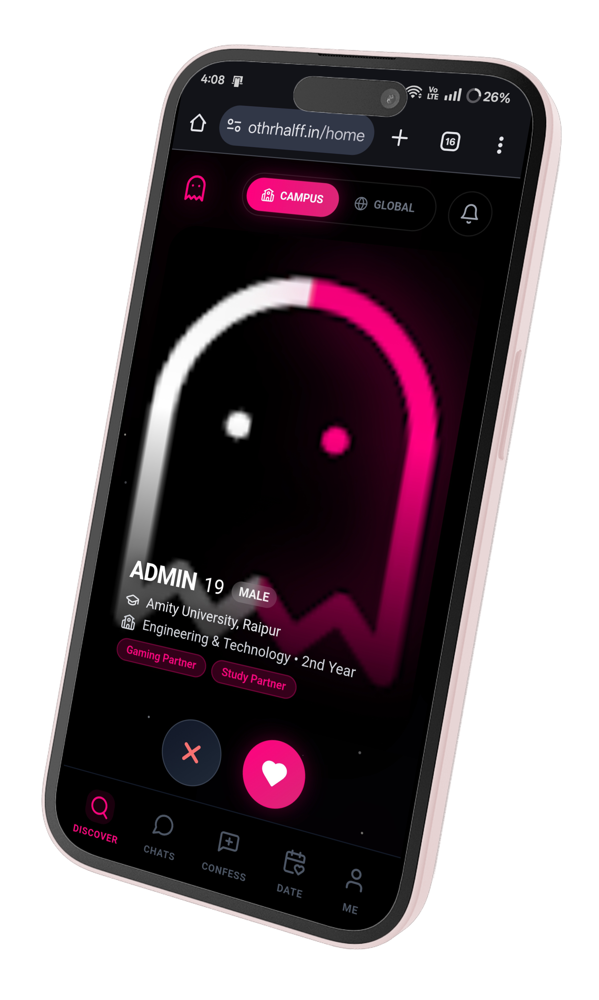
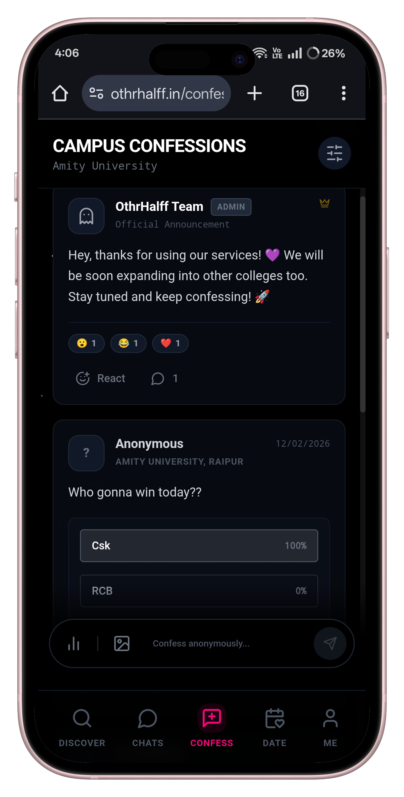
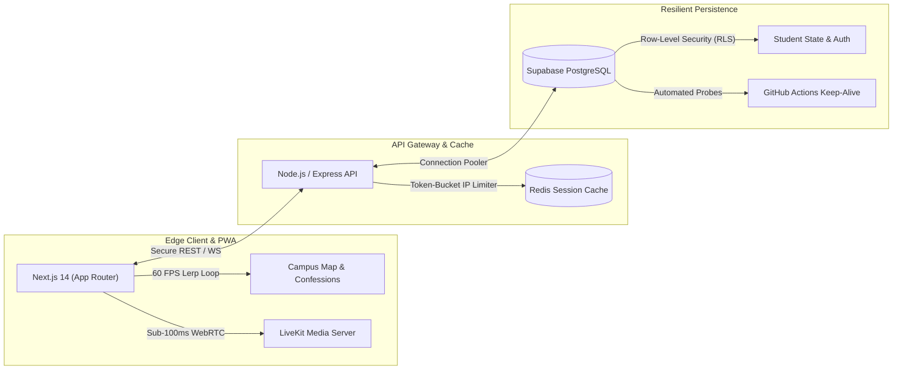

  

**[Live: othrhalff.in ↗](https://www.othrhalff.in/)**
&nbsp;&nbsp;·&nbsp;&nbsp;
**[Portfolio ↗](https://portfolio-87o6g7bkx-nikhils-projects-bc11754d.vercel.app/)**
&nbsp;&nbsp;·&nbsp;&nbsp;
**[X (@Depth_walker) ↗](https://x.com/Depth_walker)**
&nbsp;&nbsp;·&nbsp;&nbsp;
**[LinkedIn ↗](https://www.linkedin.com/in/nikhil-yadav-ba253b326/)**
&nbsp;&nbsp;·&nbsp;&nbsp;
**[Direct Dispatch ↗](mailto:nikhilyadav200530@gmail.com)**

---

### ⚓ Flagship Venture: [Othrhalff](https://www.othrhalff.in/)

> **The Verified Campus Connection Network**  
> *Production deployment: 400+ active students across 7 countries · Sub-100ms WebRTC voice & video calls · Ephemeral 24h stories · Interactive 2D campus world*

 

  
  
  

  <code>Deployment: Live in Production</code> &nbsp;·&nbsp;
  <code>Scale: 400+ Active Students</code> &nbsp;·&nbsp;
  <code>Repository: <a href="https://github.com/Nikhil-Vzo/Othrhalff">Nikhil-Vzo/Othrhalff</a></code>

 

#### 📐 System Architecture:

 

#### Architectural Solutions & Engineering Log:

| Production Problem | Root Cause | Engineering Solution |
|:---|:---|:---|
| **Hot-Path Query Latency** | Write-amplification during student match timeline fetches. | Built compound B-tree indexes across primary foreign keys (`user_id`, `created_at`, `status`), cutting fetch latency by **35%**. |
| **60 FPS Map Movement** | Standard React state diffing dropping frames on 30+ simultaneous campus avatars. | Bypassed React state loops using native `requestAnimationFrame` with a 15% distance lerp updating DOM `translate3d` transforms directly. |
| **Confession Wall RLS Gate** | Unauthenticated mutations leaking to public database tables. | Proxied confession write operations through a dedicated backend validation service enforcing verified university email claims. |
| **Real-IP Proxy Rate Limiting** | Reverse proxy masking incoming client IPs, causing false-positive 429 cascades. | Configured Express `trust proxy` upstream resolution with token-bucket IP throttles to protect endpoints under traffic surges. |
| **Database Cold-Start Mitigation** | Inactive cloud databases pausing on free-tier dormant schedules. | Engineered an automated, resilient GitHub Actions keep-alive pipeline running scheduled health probes with zero-exit-code error masking. |

---

### 🛠️ Engineered Systems & Platforms

| Platform | Role / Context | Technical Deliverables |
|:---|:---|:---|
| **[TEDx AUC Platform](https://github.com/Nikhil-Vzo/TedX_Auc)** | Official Event & Ticketing Engine | Autonomous ticketing architecture for TEDx Amity University Chhattisgarh featuring dynamic seating state machines, cryptographic QR verification, and transactional dispatch. |
| **[FairWater SCADA](https://github.com/Nikhil-Vzo/FairWater_Scada-Management)** | IIIT Raipur "HackaSoul" | Real-time telemetry monitoring and SCADA infrastructure engineered for fault-tolerant municipal water telemetry under degraded, high-latency network conditions. |

---

### ⚡ Technical Arsenal

  

| Category | Battle-Tested Technologies |
|:---|:---|
| **Frontend & Real-Time** | `Next.js 14 (App Router)` · `React 18` · `TypeScript` · `Tailwind CSS` · `WebRTC` · `LiveKit Cloud` |
| **Backend & Distributed** | `Node.js 20` · `Express` · `REST Architecture` · `WebSockets` · `Redis (Caches & Rate Limiting)` |
| **Persistence & Security** | `PostgreSQL` · `Supabase (Row-Level Security & Triggers)` · `MongoDB` |
| **Infrastructure & CI/CD** | `Docker` · `GitHub Actions CI/CD` · `Vercel Edge` · `Render` · `Linux` |

---

Direct dispatch: <strong><a href="mailto:nikhilyadav200530@gmail.com">nikhilyadav200530@gmail.com</a></strong> · X: <strong><a href="https://x.com/Depth_walker">@Depth_walker</a></strong> · Founder of <strong><a href="https://www.othrhalff.in/">Othrhalff</a></strong>

