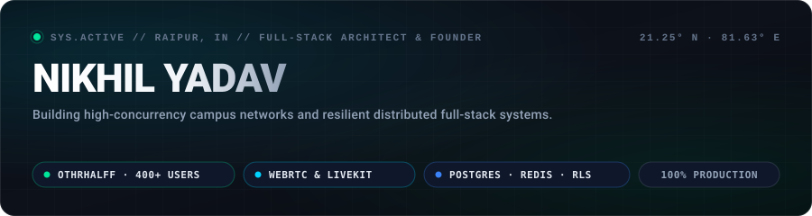

  

**[Live: othrhalff.in ↗](https://www.othrhalff.in/)**
&nbsp;&nbsp;·&nbsp;&nbsp;
**[Portfolio ↗](https://portfolio-87o6g7bkx-nikhils-projects-bc11754d.vercel.app/)**
&nbsp;&nbsp;·&nbsp;&nbsp;
**[X / Twitter ↗](https://x.com/Depth_walker)**
&nbsp;&nbsp;·&nbsp;&nbsp;
**[LinkedIn ↗](https://www.linkedin.com/in/nikhil-yadav-ba253b326/)**
&nbsp;&nbsp;·&nbsp;&nbsp;
**[Direct Dispatch ↗](mailto:nikhilyadav200530@gmail.com)**

---

### ⚓ Flagship Venture: [Othrhalff](https://www.othrhalff.in/)

> **The Verified Campus Connection Network**  
> *Production deployment: 400+ active students across 7 countries · Sub-100ms WebRTC voice & video calls · Ephemeral 24h stories · Interactive 2D campus world*

 

  
  
  

  <code>Status: Live in Production</code> &nbsp;·&nbsp;
  <code>Scale: 400+ Active Students</code> &nbsp;·&nbsp;
  <code>Source: <a href="https://github.com/Nikhil-Vzo/Othrhalff">Nikhil-Vzo/Othrhalff</a></code>

#### Architecture & Production Engineering:

| Layer | Stack | Architectural Implementation |
|:---|:---|:---|
| **Frontend & UI** | Next.js 14, TypeScript, Tailwind | Sub-second App Router navigation, 60 FPS `requestAnimationFrame` canvas movement loops bypassing React diffing, responsive PWA shell. |
| **Real-Time Media** | WebRTC & LiveKit Cloud | Sub-100ms peer connection handshakes, adaptive bitrate audio/video streaming, zero phone-number exposure. |
| **Database & Auth** | Supabase (PostgreSQL), Custom RLS | Granular Row-Level Security policies, atomic qualification RPC procedures, resilient automated keep-alive health probes. |
| **Caching & Queues** | Redis & Express Gateway | Token-bucket IP rate-limiting, live presence heartbeats, and sub-10ms session cache retrieval. |
| **Edge Graphics** | Edge OpenGraph Engine (`@vercel/og`) | Serverless microservice generating personalized confession & match preview graphics dynamically at the edge. |

---

### 🛠️ Engineered Systems & Platforms

| Platform | Context | Architectural Deliverables |
|:---|:---|:---|
| **[TEDx AUC Engine](https://github.com/Nikhil-Vzo/TedX_Auc)** | Official Event & Ticketing Platform | Built an autonomous ticketing pipeline for TEDx Amity University Chhattisgarh featuring dynamic seating state machines, cryptographic QR pass generation, and transactional email dispatch. |
| **[FairWater SCADA](https://github.com/Nikhil-Vzo/FairWater_Scada-Management)** | IIIT Raipur "HackaSoul" | Real-time telemetry monitoring and SCADA infrastructure engineered for fault-tolerant municipal water telemetry under constrained or high-latency network conditions. |

---

### ⚡ Battle-Tested Engineering Stack

| Domain | Production Tooling |
|:---|:---|
| **Frontend & Real-Time** | `Next.js 14 (App Router)` · `React 18` · `TypeScript` · `Tailwind CSS` · `WebRTC` · `LiveKit` |
| **Backend & Distributed** | `Node.js 20` · `Express` · `WebSockets` · `REST Architecture` · `Redis (Sessions & Rate Limiting)` |
| **Databases & Security** | `PostgreSQL` · `Supabase (Row-Level Security & Realtime)` · `MongoDB` |
| **DevOps & Tooling** | `Docker` · `GitHub Actions CI/CD` · `Vercel` · `Render` · `Linux` |

---

### 📊 GitHub Activity & Telemetry

&nbsp;

  

Direct dispatch: <strong>nikhilyadav200530@gmail.com</strong> · Founder of <strong><a href="https://www.othrhalff.in/">Othrhalff</a></strong>

