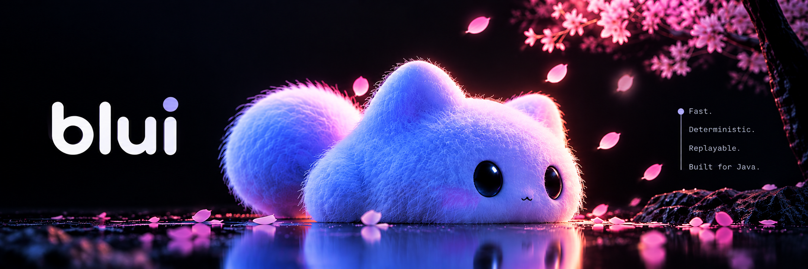

---

  ⚓ Flagship Works

#### 🌐 [Othrhalff](https://www.othrhalff.in/) — *The Verified Campus Connection Network*
> **Live in Production** · 400+ Active Students across 7 Countries · Sub-100ms WebRTC Calls · 24h Ephemeral Stories · 2D Virtual Campus

 

  
  
  

  <code>Stack: Next.js 14 · Supabase (PostgreSQL RLS) · Redis · LiveKit WebRTC</code> &nbsp;·&nbsp;
  <code><a href="https://github.com/Nikhil-Vzo/Othrhalff">View Repository ↗</a></code>

 

#### ⚡ [Blui](https://github.com/Nikhil-Vzo/Blui) — *AI Agent Runtime &amp; Safety Harness*
> **Upcoming / Active Core** · High-performance deterministic AI agent runtime built in pure Java 24.
> *Project Loom Virtual Threads (`StructuredTaskScope`) · Zero External Dependencies · Hard Token Budget Governors · Deterministic Time-Travel Replay.*

 

  

  <code>Stack: Java 24 · Virtual Threads · Concurrency · Sealed State Machines</code> &nbsp;·&nbsp;
  <code><a href="https://github.com/Nikhil-Vzo/Blui">View Repository ↗</a></code>

---

### 🛠️ Shipped Production Systems

| Platform | Context | Focus |
|:---|:---|:---|
| **[TEDx AUC Engine](https://github.com/Nikhil-Vzo/TedX_Auc)** | Official Event & Ticketing Platform | Autonomous ticketing pipeline with dynamic seating state machines and cryptographic QR validation. |
| **[FairWater SCADA](https://github.com/Nikhil-Vzo/FairWater_Scada-Management)** | IIIT Raipur "HackaSoul" | Real-time municipal water telemetry monitoring designed for degraded, high-latency network conditions. |

---

### ⚡ Weapons of Choice

---

### 📬 Direct Dispatch & Contact

| Channel | Destination |
|:---|:---|
| **Direct Email** | [nikhilyadav200530@gmail.com](mailto:nikhilyadav200530@gmail.com) |
| **X (Twitter)** | [@Depth_walker](https://x.com/Depth_walker) |
| **LinkedIn** | [/in/nikhil-yadav-ba253b326](https://www.linkedin.com/in/nikhil-yadav-ba253b326/) |
| **Interactive Portfolio** | [Live Portfolio ↗](https://portfolio-87o6g7bkx-nikhils-projects-bc11754d.vercel.app/) |
| **Live Platform** | [othrhalff.in ↗](https://www.othrhalff.in/) |

 

  Nikhil Yadav · Raipur, India · <code>21.25°N, 81.63°E</code> · Autonomous Systems &amp; Craft

